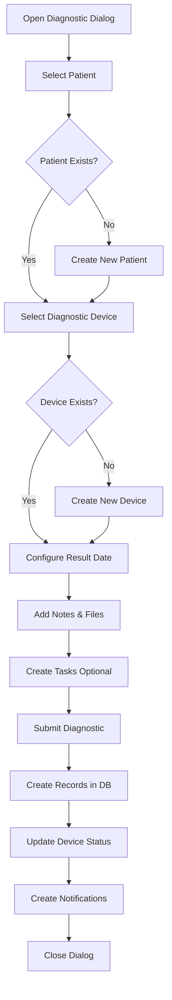

# Diagnostic Stepper Workflow Analysis

## Overview
The diagnostic stepper is a multi-step form dialog used to create diagnostic records for patients in the Espace irismedical system. It guides users through patient selection, equipment selection, and task creation.

## Main Components

### 1. DiagnosticStepperDialog
**Location:** `/src/pages/roles/admin/dashboard/components/DiagnosticStepperDialog.tsx`
- Main container component for the diagnostic workflow
- Manages the 3-step process
- Handles form submission and API calls
- Includes file upload functionality
- Creates tasks and notifications

### 2. DiagnosticStepperSidebar
**Location:** `/src/pages/roles/admin/dashboard/components/DiagnosticStepperSidebar.tsx`
- Visual stepper indicator on the left side
- Shows patient information card when selected
- Displays current step progress
- Shows total price (always free for diagnostics)

### 3. Step Components

#### Step 1: ClientSelectionStep
**Location:** `/src/pages/roles/admin/dashboard/components/steps/ClientSelectionStep.tsx`
- Patient selection interface
- Search functionality for existing patients
- Create new patient option
- Filters to show only patients (diagnostics are patient-only)

#### Step 2: NewDiagnosticProductStep
**Location:** `/src/pages/roles/admin/dashboard/components/steps/diagnostic/NewDiagnosticProductStep.tsx`
- Equipment selection for diagnostic devices
- Create new diagnostic device option
- Only shows DIAGNOSTIC_DEVICE type equipment
- Parameter configuration for result due dates

#### Step 3: Finalization
- Embedded directly in DiagnosticStepperDialog
- Notes section for diagnostic comments
- File upload for patient documents
- Task creation for follow-up
- Summary and submission

### 4. Supporting Components

#### DiagnosticProductDialog
**Location:** `/src/pages/roles/admin/dashboard/components/steps/diagnostic/DiagnosticProductDialog.tsx`
- Modal for selecting existing diagnostic devices
- Search and filter functionality
- Shows device status (Active, Reserved, etc.)
- Only allows selection of ACTIVE devices

#### ParameterConfigurationDialog
**Location:** `/src/pages/roles/admin/dashboard/components/steps/diagnostic/ParameterConfigurationDialog.tsx`
- Configure result due dates for diagnostic devices
- Updates device reservation status
- Creates calendar reminders

#### PatientInfoCard
**Location:** `/src/pages/roles/admin/dashboard/components/PatientInfoCard.tsx`
- Displays selected patient information
- Shows contact details, address, CIN
- Visual status indicator

#### DiagnosticTaskFormDialog
- Wrapper around TaskFormDialog
- Pre-fills patient ID and follow-up date
- Creates tasks linked to the diagnostic

## API Endpoints

### 1. `/api/diagnostics/index.ts`
- **GET**: Fetch all diagnostics with related data
- **POST**: Create new diagnostic record
- **PUT**: Update existing diagnostic
- **DELETE**: Delete diagnostic and reset device status

**POST Data Structure:**
```json
{
  "clientId": "patient-id",
  "clientType": "patient",
  "medicalDeviceId": "device-id",
  "products": [...],
  "followUpDate": "ISO-date",
  "totalPrice": 0,
  "notes": "string",
  "fileUrls": [...]
}
```

### 2. `/api/diagnostic-parameters/index.ts`
- **GET**: Fetch device configuration
- **POST**: Save result due date and reserve device

### 3. `/api/renseignements/patients/[id].ts`
- Fetches patient details for display

### 4. `/api/medical-devices/index.ts`
- **GET**: Fetch diagnostic devices (filtered by type)
- **POST**: Create new diagnostic device

## Data Flow

1. **Patient Selection**
   - Fetch patients from `/api/renseignements/patients`
   - Select or create new patient
   - Store patient ID in state

2. **Device Selection**
   - Fetch devices from `/api/medical-devices?type=DIAGNOSTIC_DEVICE`
   - Select or create diagnostic device
   - Configure result due date via `/api/diagnostic-parameters`
   - Device status changes to RESERVED

3. **Finalization**
   - Collect notes and upload files
   - Create diagnostic via POST to `/api/diagnostics`
   - Create DiagnosticResult record (with PENDING status)
   - Create PatientHistory entry
   - Create notification for result tracking
   - Optional: Create follow-up task

## Database Models Involved

- **Diagnostic**: Main diagnostic record
- **DiagnosticResult**: Stores IAH values and status
- **MedicalDevice**: Equipment used for diagnostic
- **Patient**: Patient receiving diagnostic
- **PatientHistory**: Audit trail
- **Task**: Follow-up tasks
- **File**: Uploaded documents
- **Notification**: Result reminders

## Issues and Missing References

### 1. Missing Components
- ✅ **TaskFormDialog** and **AddTaskButton** exist in `/src/components/tasks/`
- ✅ **FileUpload** component exists in `/src/components/forms/components/`
- ✅ **DiagnosticDeviceForm** exists in `/src/components/appareils/forms/`

### 2. Potential Issues

#### a. Duplicate Code
- DiagnosticStepperDialog exists in both admin and employee folders
- Consider creating a shared component to avoid duplication

#### b. Error Handling
- Limited error feedback when API calls fail
- No retry mechanism for failed submissions
- File upload errors not properly displayed to user

#### c. State Management
- Complex state management across multiple steps
- No state persistence if dialog is accidentally closed
- Consider using a form library like react-hook-form for the entire flow

#### d. API Inconsistencies
- POST to `/api/diagnostics` expects both `medicalDeviceId` and `products` array
- The products array seems redundant since only one device is allowed
- Consider simplifying to just use `medicalDeviceId`

#### e. Device Status Management
- Devices are marked as RESERVED but no automatic cleanup if diagnostic is cancelled
- No validation to prevent selecting already reserved devices
- Missing logic to release device if diagnostic creation fails

#### f. File Upload
- Files are uploaded but URLs are passed as strings
- No validation of file types or sizes in the diagnostic flow
- Missing cleanup if diagnostic creation fails after file upload

### 3. Improvements Needed

1. **Add Loading States**
   - Show loading indicators during API calls
   - Disable form during submission

2. **Improve Validation**
   - Validate required fields before allowing next step
   - Check device availability before selection

3. **Add Confirmation**
   - Add confirmation dialog before final submission
   - Show summary of all selected data

4. **Better Error Recovery**
   - Allow retry on failure
   - Save draft state to localStorage
   - Cleanup reserved devices on failure

5. **Accessibility**
   - Add ARIA labels to form elements
   - Ensure keyboard navigation works properly
   - Add focus management between steps

## Workflow Summary



## File Structure
```
/src/pages/roles/admin/dashboard/components/
├── DiagnosticStepperDialog.tsx       # Main dialog
├── DiagnosticStepperSidebar.tsx      # Sidebar stepper
├── PatientInfoCard.tsx                # Patient info display
└── steps/
    ├── ClientSelectionStep.tsx       # Step 1
    └── diagnostic/
        ├── NewDiagnosticProductStep.tsx    # Step 2
        ├── DiagnosticProductDialog.tsx     # Device selection modal
        └── ParameterConfigurationDialog.tsx # Date configuration

/src/pages/api/
├── diagnostics/
│   └── index.ts                      # Main diagnostic API
├── diagnostic-parameters/
│   └── index.ts                      # Device configuration API
├── medical-devices/
│   └── [id].ts                       # Device management
└── renseignements/patients/
    └── [id].ts                       # Patient data
```

## Testing Checklist

- [ ] Patient selection works correctly
- [ ] New patient creation from dialog
- [ ] Device filtering shows only DIAGNOSTIC_DEVICE type
- [ ] Device reservation updates status
- [ ] File upload works and associates with patient
- [ ] Task creation links to diagnostic
- [ ] Notification is created for result tracking
- [ ] Device status resets on diagnostic deletion
- [ ] Error handling for all API failures
- [ ] Form validation prevents invalid submissions